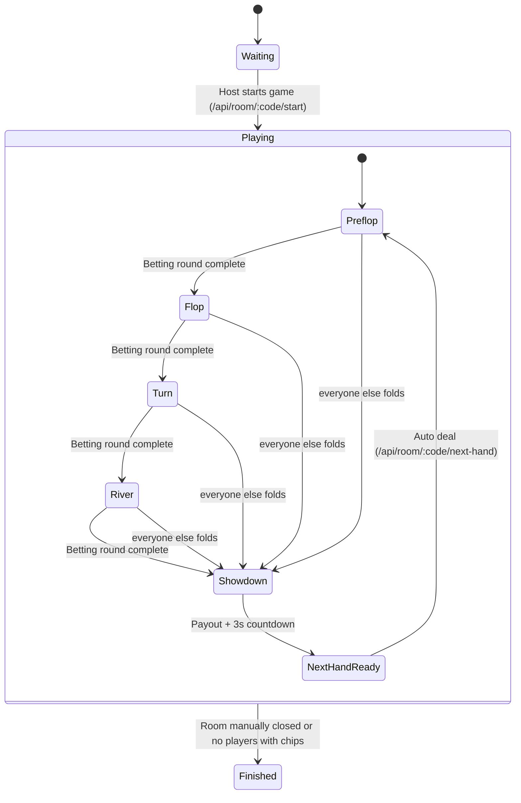
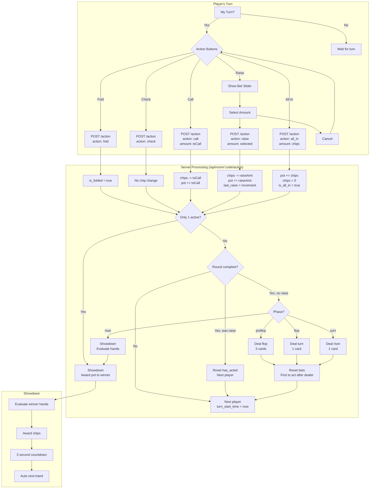
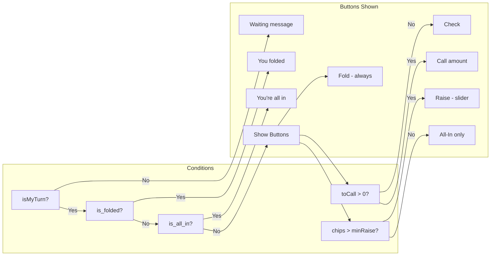
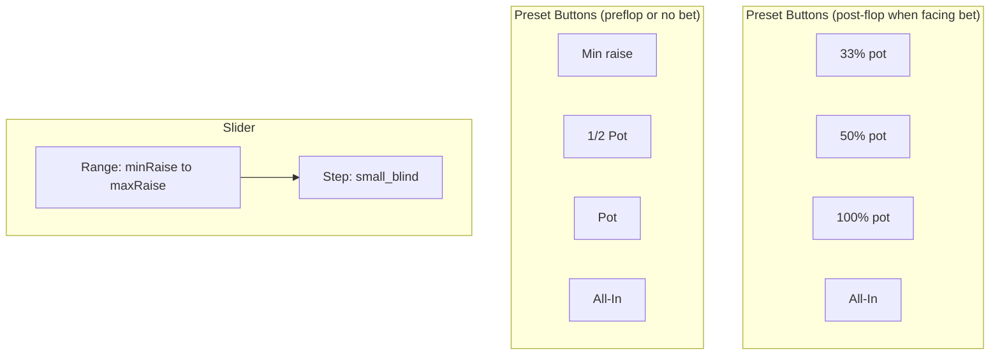
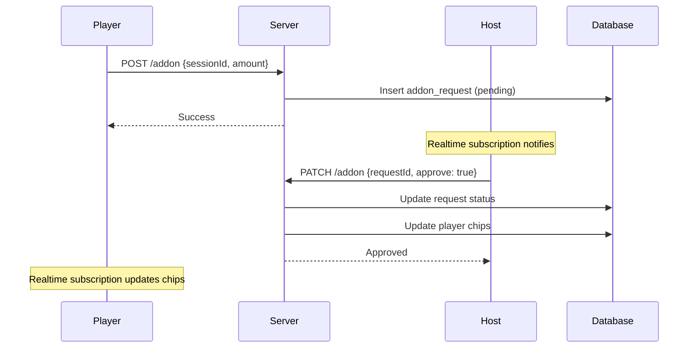

## Poker Game State Machine

Mermaid state diagram of the core game lifecycle (room + hand + betting phases).

## Player Action Flow

Flowchart showing all possible actions during a player's turn.

## Button Visibility Logic

## Bet Slider Presets

## Add-on Request Flow

### Notes
- Actions inside phases are processed server-side (`/api/room/:code/action`) to keep authoritative turn order, chips, and pot splits.
- A betting round completes when all active players have acted and matched the current bet or are all-in.
- If only one active player remains, transition to `Showdown` immediately and award the pot.
- Blinds and new decks are dealt on `start` (first hand) and `next-hand` (subsequent hands); `turn_start_time` and `total_contributed` reset per hand.
- Add-ons do not change phase; they only adjust a player’s chip stack when approved.

## Data Model (key fields)
- `rooms`: `code`, `status`, `host_session_id`, `small_blind`, `big_blind`, `starting_chips`, `hand_count`.
- `players`: `room_id`, `session_id`, `name`, `seat`, `chips`, `time_bank`, `is_connected`.
- `hands`: `room_id`, `dealer_seat`, `community_cards`, `pot`, `current_bet`, `current_seat`, `phase`, `deck`, `version`, `last_raise`, `turn_start_time`.
- `player_hands`: `hand_id`, `player_id`, `hole_cards`, `current_bet`, `total_contributed`, `has_acted`, `is_folded`, `is_all_in`.
- `actions`: `hand_id`, `player_id`, `action`, `amount`, `created_at`.
- `addon_requests`: `room_id`, `player_id`, `amount`, `status`.

## API Surface (server routes)
- `POST /api/room/create` — Body `{ sessionId, name, startingChips?, smallBlind?, bigBlind? }`  
  - Side effects: create room, host player seated at 0 with starting chips.
- `POST /api/room/[code]/join` — Body `{ sessionId, name }`  
  - Valid only when room.status=`waiting`. Seats next open seat, sets chips to `starting_chips`.
- `POST /api/room/[code]/start` — Body `{ sessionId }` (host only)  
  - Creates hand v1, shuffles deck, posts blinds, sets `room.status=playing`, seeds `total_contributed` with blinds.
- `POST /api/room/[code]/action` — Body `{ sessionId, action, amount? }`  
  - Updates player bet/contribution/chips, logs action, advances turn/phase or ends hand with payouts.
- `POST /api/room/[code]/next-hand` — Body `{ sessionId }` (host only)  
  - Increments hand version/count, rotates dealer, deals new hand, posts blinds, resets per-hand state.
- `POST /api/room/[code]/addon` — Body `{ sessionId, amount }`  
  - Creates pending add-on request.
- `PATCH /api/room/[code]/addon` — Body `{ sessionId, requestId, approve }` (host only)  
  - Approves/rejects request; on approve, adds chips to player.
- `GET /api/room/[code]/addon` — (now unused in UI) Returns pending requests for host view.

## Client Data Flow
- Session: `lib/session.ts` issues a local UUID stored in `localStorage` (no email required).
- State fetch: `hooks/use-game-state` uses Supabase client to load `room`, `players`, `hands` (latest), `player_hands` (per current hand).
- Realtime: subscriptions on `rooms` (by code), `players`/`hands` filtered by `room_id`, and `player_hands` filtered by `hand_id`. Add-on panel listens to `addon_requests` by `room_id`.
- Presence: `use-presence` joins `presence:roomCode` channel; marks `players.is_connected` true/false.
- UI-only derivations: `PokerGame` computes display-only winner info; authoritative payouts come from the server action route.

## Server Action Execution (high level)
1) **Validate** session and turn ownership (`/action` checks `hand.current_seat` vs player seat).  
2) **Mutate**: adjust `current_bet`, `total_contributed`, `chips`, `pot`, `last_raise`, `current_bet`.  
3) **Log**: insert into `actions`.  
4) **Advance**:
   - If one active player remains → `showdown`, pay pot.
   - Else if betting round complete → deal next community cards or showdown, reset `has_acted/current_bet` as needed, set `current_seat`.
   - Else → move `current_seat` to next active.
5) **Timing**: updates `turn_start_time` on seat change/phase change.

## Security Notes
- Joining still requires only room code + name; no email/auth needed.  
- Integrity relies on server-side validation and (recommended) RLS: do not trust client-sent `sessionId` without policies tying rows to it.  
- Authoritative game logic stays server-side; client calculations never change DB state.

## Performance Notes
- Parallel fetch for room/players/hand; `total_contributed` avoids recomputing pot from logs.
- Supabase realtime is filtered per room/hand to reduce fan-out.
- Winner calc uses precomputed contributions; avoids scanning `actions` at showdown.

## Player Action Flow (UI ➜ API ➜ DB)
- **Fold button** (`ActionButtons`): POST `/api/room/:code/action` `{ action:"fold", sessionId }`  
  - Server: marks `player_hands.is_folded=true`, `has_acted=true`; advances turn or ends hand if one remains; no chip change.
- **Check button**: POST `/action` `{ action:"check" }` (only if `toCall=0`)  
  - Server: `has_acted=true`; advances turn/phase.
- **Call button**: POST `/action` `{ action:"call", amount: toCall }`  
  - Server: moves `toCall` from `players.chips` → `player_hands.current_bet/total_contributed` and `hands.pot`; sets `has_acted=true`; may mark all-in.
- **Raise (slider)**: Opens `BetSlider`; on confirm POST `/action` `{ action:"raise", amount }`  
  - Server: increases `current_bet`, `last_raise`, `player_hands.current_bet/total_contributed`, deducts chips, resets others’ `has_acted` where needed, sets next seat or advances phase.
- **All In button**: POST `/action` `{ action:"all_in", amount:maxBet }`  
  - Server: pushes all remaining chips to `current_bet/total_contributed`, updates pot, may update `last_raise` if it’s a raise, marks `is_all_in=true`, advances turn/phase logic.
- **Turn timer auto-fold**: `TurnTimer` triggers `handleTimeout` ➜ POST `/action` `{ action:"fold" }` when timebank exhausted.
- **Start Game** (host in lobby): POST `/api/room/:code/start`  
  - Server: shuffles deck (CSPRNG), posts blinds (updates `current_bet` + `total_contributed`), sets `status=playing`, seeds `hands` + `player_hands`, sets `current_seat`.
- **Next Hand** (host after showdown): POST `/api/room/:code/next-hand`  
  - Server: rotates dealer, shuffles, posts blinds, increments hand version/count, resets per-hand state.
- **Add-on Request**: POST `/api/room/:code/addon` `{ amount }` from `AddonPanel`  
  - Server: inserts pending `addon_requests`.  
  - Host Approve/Reject: PATCH `/addon` `{ requestId, approve }`; on approve chips are added to `players.chips`.

### Data mutations per action (server)
- Bets: `players.chips` decreases; `player_hands.current_bet` and `player_hands.total_contributed` increase; `hands.pot` increases.
- Turn/phase: `hands.current_seat`, `hands.current_bet`, `hands.last_raise`, `hands.phase`, `hands.community_cards`, `hands.turn_start_time` update.
- Hand end: winnings distributed to `players.chips`; `hands.pot` set to 0; `hands.phase="showdown"`, `current_seat=null`.
- Logs: every action inserted into `actions`.

### Client feedback
- UI disables buttons while `isSubmitting`.
- `TurnTimer` counts down and auto-folds.
- Realtime channels refresh local state after DB changes; no manual polling needed for actions.
